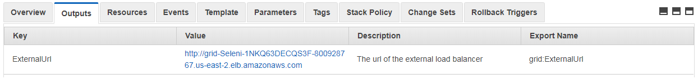

# selenium-grid-fargate

A scalable yet disposable Selenium Grid for large-scale testing. Built using AWS ECS-Fargate.

Presentation: https://speakerdeck.com/mmehta10/run-tests-at-scale-with-on-demand-selenium-grid-using-aws-fargate

----

## To start your own grid

1. Log into your AWS account

2. Go to Services > CloudFormation

3. Click CreateStack

4. Upload the CloudFormation template provided here (either [json](cft.json) or [yaml](cft.yml)). Click Next.

5. Give your stack a name. Change value of **ContainerCpu, ContainerMemory** and **SeleniumImageVersion** as desired. If this is your first time with AWS, it is recommended to work with defaults. Click Next twice, and check the box to 'I acknowledge that AWS CloudFormation might create IAM resources.' Click Create.

 

Stack should be created in a few minutes. You should be able to access the Selenium Grid on **ExternalUrl:4444** in the Outputs section of the created stack.
  

----

## Implementation based on –

- https://github.com/awslabs/aws-cloudformation-templates/tree/master/aws/services/ECS
- https://github.com/nathanpeck/aws-cloudformation-fargate
- Blog post: https://aws.amazon.com/blogs/compute/task-networking-in-aws-fargate/

## CAUTION

**DO NOT FORGET** to delete your stack when not in use, else you would end up incurring charges for idle resources.
